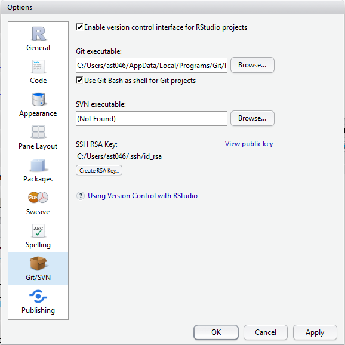

# git, Rstudio og github på Windows gjennom proxy

Hvis det oppstår problemer med denne fremgangsmåten, gi gjerne beskjed til arnfinn.steindal@[skde.no|gmail.com|uit.no]

## Hvordan installere git

Du kan fint installere git på nytt og på nytt uten risiko. Den fjerner gammel git før den installerer ny.

- Last ned fra https://git-scm.com/download/win
- installer med default (ikke endre noen valg)
- git-bash.exe legges her:
```
C:\Users\$USERNAME\AppData\Local\Programs\Git\
```
- connect.exe, git.exe etc. legges her:
```
C:\Users\$USERNAME\AppData\Local\Programs\Git\mingw64\bin
```


## Gjør git klar for kamp

- Åpne gitbash.
- Legg inn navn og epost:

```sh
$ git config --global user.name "John Doe"
$ git config --global user.email johndoe@example.com
```
- Lag ssh-nøkkelpar. Vi legger den på `c:`, slik at Rstudio kan lese den senere (bytt ut `ast046` med ditt brukernavn):

```
$ ssh-keygen
Enter file in which to save the key (/p/.ssh/id_rsa): /c/Users/ast046/.ssh/id_rsa
Enter passphrase (empty for no passphrase):
Enter same passphrase again:
```

## Hvordan få git til å snakke med github gjennom proxy

- Gå inn på https://github.com/settings/ssh og legg inn din nye SSH-nøkkel (kopier over det som ligger i `/c/Users/$USERNAME/.ssh/id_rsa.pub`).
- Lag en fil kalt `config` i mappen `p/.ssh/` med følgende innhold (igjen: bytt ut `ast046` med ditt brukernavn): 

```
IdentityFile /c/Users/ast046/.ssh/id_rsa

Host githubhn
   Hostname github.com
   User git
   ProxyCommand /mingw64/bin/connect.exe -H www-proxy.helsenord.no:8080 %h %p
```
- Sjekk at git snakker med github ved å klone denne repo (ikke gå videre før dette er ok):

```
$ cd
$ git clone githubhn:arnfinn/git-r.git tmp-mappe
$ rm -rf tmp-mappe # hvis alt gikk etter planen (fjerner mappen igjen)
```
## Hvordan sette opp git i rstudio

- Legg inn følgende i `/c/Users/$USERNAME/.ssh/config` (samme som over, men på `c:` og uten første linje):

```
Host githubhn
   Hostname github.com
   User git
   ProxyCommand /mingw64/bin/connect.exe -H www-proxy.helsenord.no:8080 %h %p
```
- Legg inn følgende i `/c/Users/$USERNAME/.gitconfig` (Rstudio leser denne i steden for den på p-disken):

```
[include]
    path = /p/.gitconfig
```
<!---
- Åpne Rstudio og gå inn på `Tools/Global Options...`. Hos meg ser det slik ut:


--->

## Rstudio og github-pakker

- Skriv følgende i rstudio-konsollen
```r
library(httr)
set_config(use_proxy(url="http://www-proxy.helsenord.no", port=8080))
```
- For å installere pakker fra github
```r
library(devtools)
```

## Rstudio og shinyapps gjennom proxy

- [Opprett en ny](new_rshiny.md) eller åpne en gammel "Shiny web application" i Rstudio.
- Opprett en bruker på [shinyapps](http://www.shinyapps.io)
- Installer shinyapps fra github

```r
install_github("rstudio/shinyapps")
```

- Kjør gjennom proxy
```r
options(RCurlOptions = list(proxy = "http://www-proxy.helsenord.no:8080"))
options(shinyapps.http = "rcurl")
```
- Kopier din token fra [shinyapps](http://www.shinyapps.io/admin/#/tokens) og kopier over i "Manage Accounts"


- Last opp din shinyapp til shinyapps.io. Jeg fikk ikke til å gjøre dette ved hjelp av knappen over, men måtte gjøre dette i konsollen.

```r
shinyapps::deployApp('../my_new_shinyapp')
```

