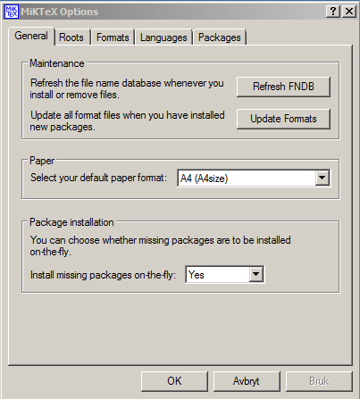
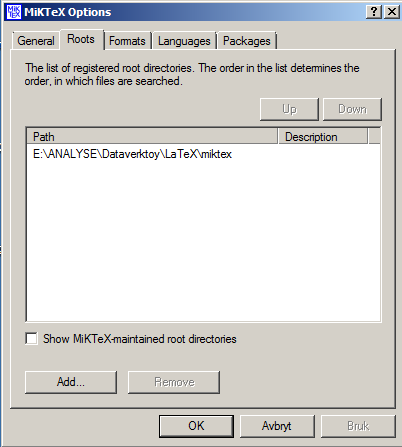
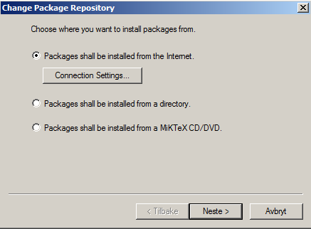
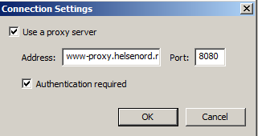

# Hvordan installere LaTeX på SKDE-maskiner

Hvis det oppstår problemer med denne fremgangsmåten, gi gjerne beskjed til arnfinn.steindal@[skde.no|gmail.com|uit.no]

## Installere MikTeX

Dette er selve LaTeX.

1. Last ned fra [denne siden](http://miktex.org/download)
2. Installer programmet på ditt hjemmeområdet på `c:`
3. Gå inn på `Start/Alle programmer/MikTeX 2.9/Maintenance/Settings`
  1. Sjekk at General-fanen ser omtrent slik ut:  
  
  2. Gå inn på Roots-fanen og legg inn følgende mappe:  
  
4. Gå inn på `START/Alle programmer/MikTeX 2.9/Maintenance/Package Manager`
  1. Gå så inn på `Repository/Change Package Repository` og trykk på `Connection Settings...`  
  
  2. Her legger man inn en proxy med adresse `www-proxy.helsenord.no` og port nummer `8080`:  

## Installere Texmaker 

Dette er programmet vi skal skrive LaTeX i.

1. Last ned fra [denne siden](http://www.xm1math.net/texmaker/download.html)
2. Installer programmet på ditt hjemmeområdet på c:  

Man kan velge et annet skriveprogram hvis man vil, f.eks [TeXnicCenter](http://www.texniccenter.org).

